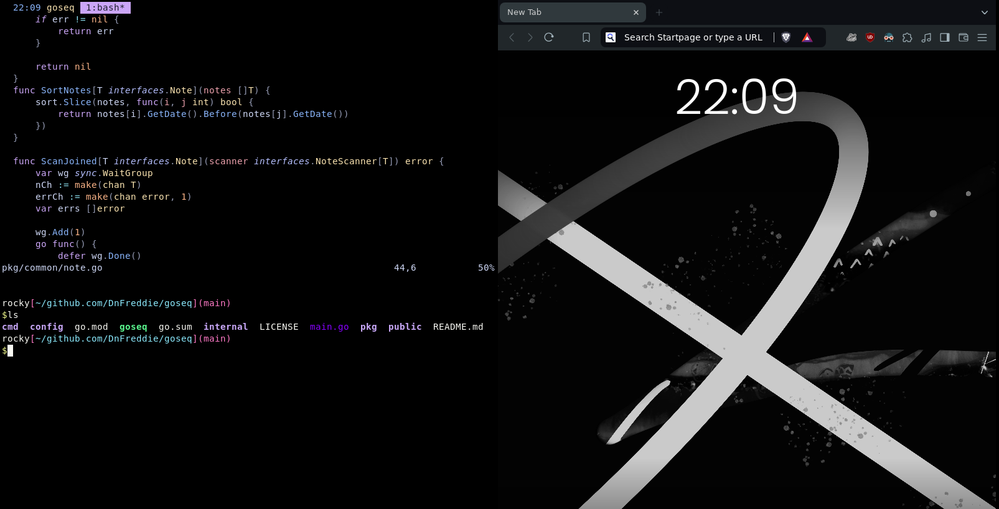

# My dotfiles 
Here a are the configuration for my developer workflow

I mostly roll with **tmux** and **bash** for my terminal stuff.
For editing, I’m all about **nvim** (*Neovim*).

Got my **Vim** config set up for making quick changes on remote machines.

I use **i3** as my window manager, and I keep it simple with no wallpaper, so if you see a black screen, don’t freak out! I use **ALT** as my mod key.

Oh and also the terminal i use is **xterm**.
<table>
  <tr>
    <td>
      
    </td>
    <td>
      <ul>
        <li><a href="/.bashrc">.bashrc</a></li>
        <li><a href="/.tmux.conf">.tmux.conf</a></li>
        <li><a href="/nvim">nvim</a></li>
        <li><a href="/vimrc">.vimrc</a></li>
        <li><a href="/i3">i3</a></li>
        <li><a href="/.Xresources">.Xresources</a></li>
        <li><a href="/rofi">rofi</a></li>
        <li><a href="/vifm">vifm</a></li>
        <li><a href="/picom">picom</a></li>
        <li><a href="/dunst">dunst</a></li>
        <li><a href="/nixos">nixos</a></li>
      </ul>
    </td>
  </tr>
</table>


## Installation
If you want to install this with Ansible, use my [desktop_env](https://github.com/DnFreddie/roles/tree/main/desktop_env) **role**.

### Example `playbook.yaml`
```yaml
- name: Install DefnotFreddie dotfiles
  hosts: yourhost
  become: yes
  gather_facts: yes
  roles:
    - desktop_env
```

### Running the Playbook
To ensure everything will run smoothly, first execute the playbook with the check flag.

This will check for any issues without making any changes. After verifying, you can run it normally.

```bash
# First run with the check flag
ansible-playbook playbook.yaml -i <inventory> --check --ask-become
```

Remove the `--check` flag to run it normally:

```bash
# Run the playbook normally
ansible-playbook playbook.yaml -i <inventory> --ask-become
```
